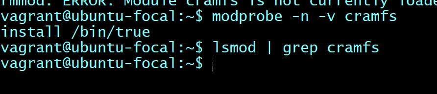

> Disable unused filesystems

In order to reduced the local attack surface of an Ubuntu system, removing support for unneeded filesystem types is needed.

 Audit output before carrying out CIS

 Audit output after carrying out CIS