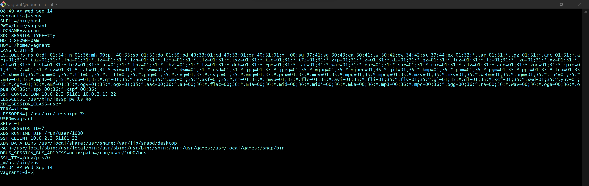
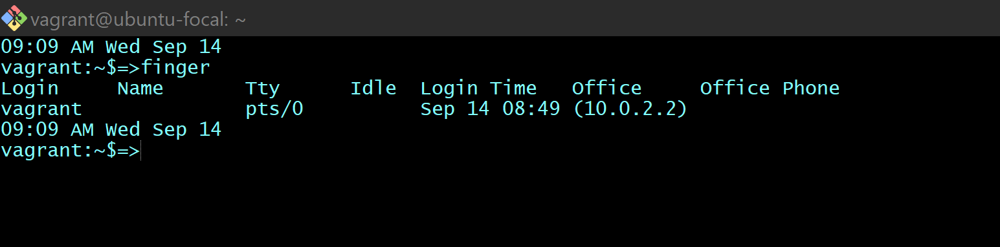
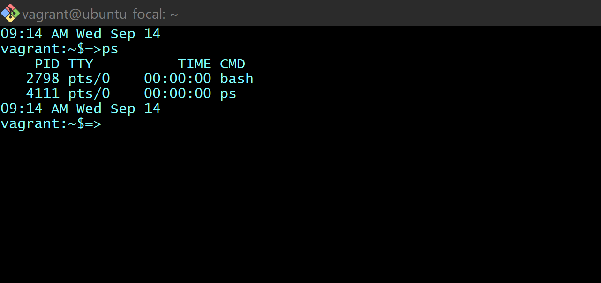
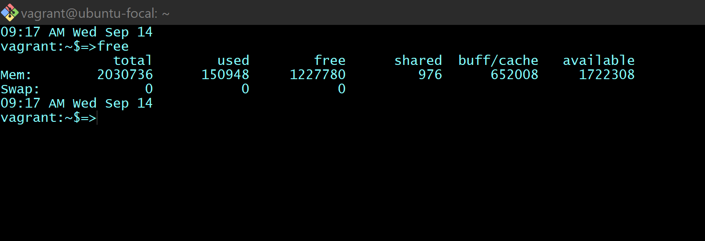
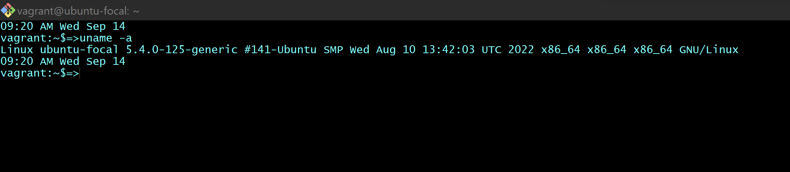
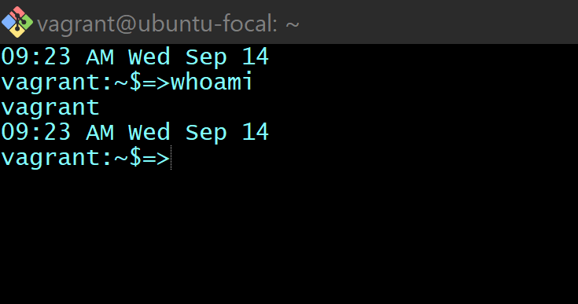
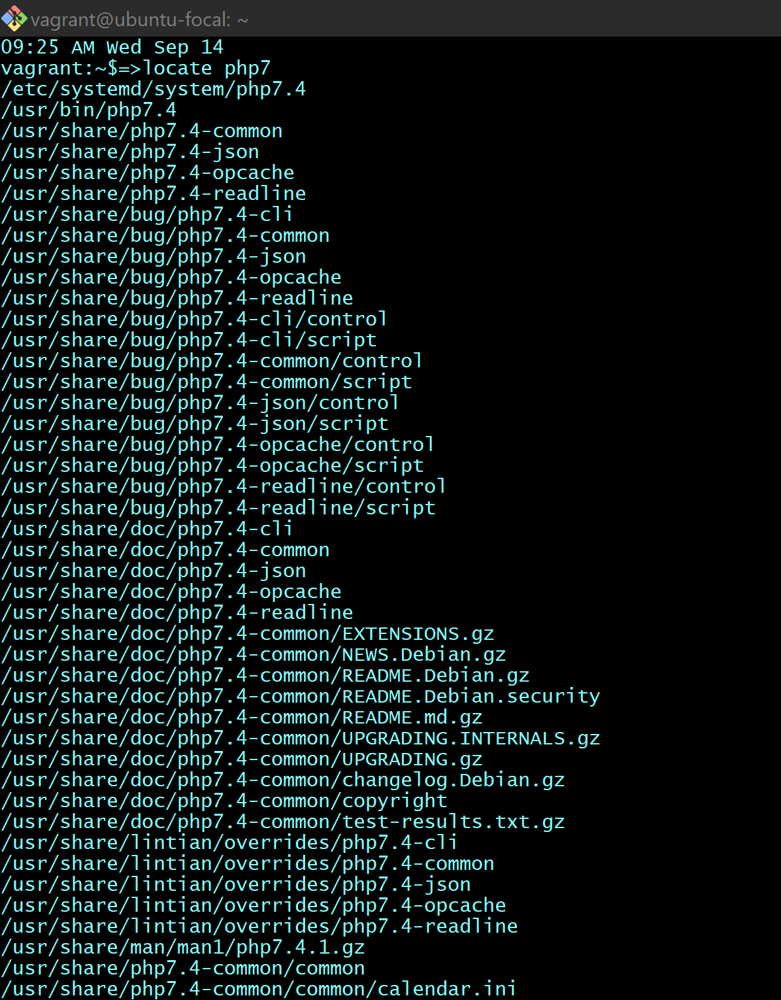
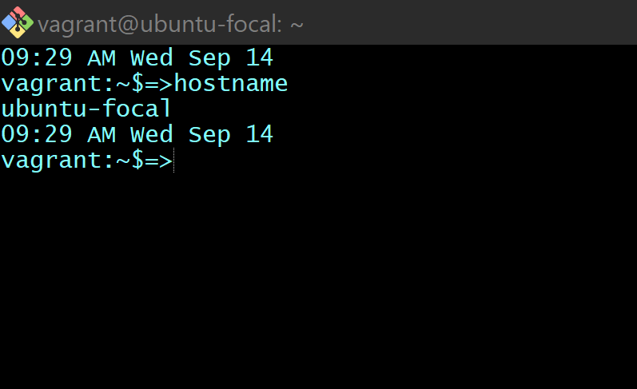
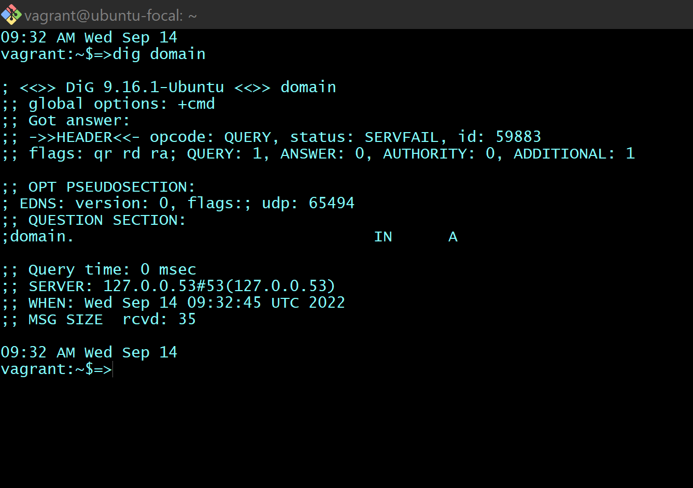
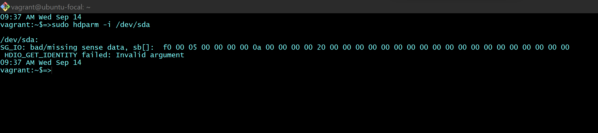

#**TEN LINUX COMMANDS**
1. `env` : Displays all environment variables 
2. `finger` Shows information of all the users logged in 
3. `ps` Give the status of processes running for a user 
4. `free` Gives free RAM on your system 
5. `uname` Display Linux system information 
6. `whoami` Who you are logged in as 
7. `locate` Find files and directories by name 
8. `hostname` Display the network address of the host name. 
9. `dig domain` Display DNS information for domain 
10. `hdparm -i /dev/sda` Show info about disk sda 